# Лабораторная работа №6

## Система контроля версий

### Цель лабораторной работы:
Изучение базовых возможностей системы
управления версиями, опыт работы с Git Api, опыт работы с локальным и удаленным репозиторием

### Ход работы:

#### 1. Создание аккаунта на сайте GitHub.
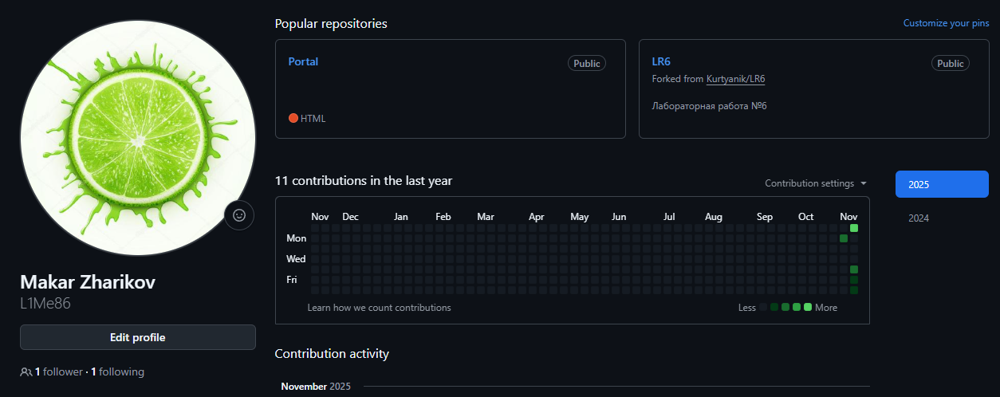

#### 2. Создание форка в личное хранилище.
Выполнен форк репозитория: https://github.com/L1Me86/LR6

#### 3. Установка Git.

#### 4. Настройка Git.
```
git config --global user.name "4414 Жариков М. С."
git config --global user.email makareha86@gmail.com
```
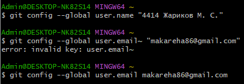

#### 5. Клонирование своего репозитория.
```
git clone https://github.com/L1Me86/LR6.git
```
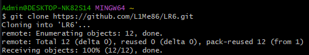

#### 6. Добавление файла через GitHub. Обновление репозитория.
```
git pull
```
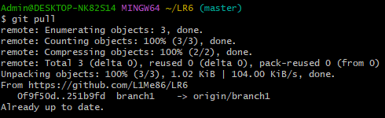

#### 7. Получение истории операций для каждой из веток.
```
git log
git log master
```
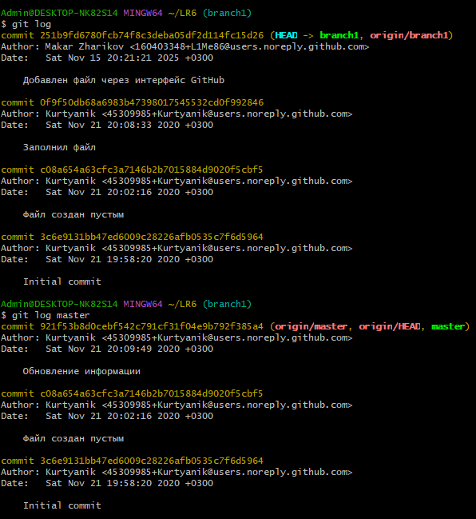

#### 8. Просмотр последних изменений.
```
git show
```
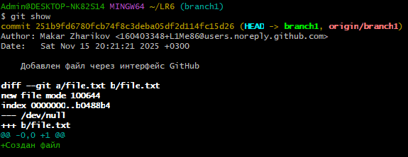

#### 9. Выполнение слияние в ветку master, решение конфликта.
```
git merge branch1
git commit -m "Решен конфликт"
git push
```
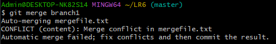
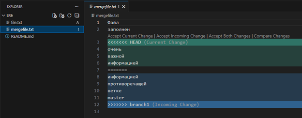
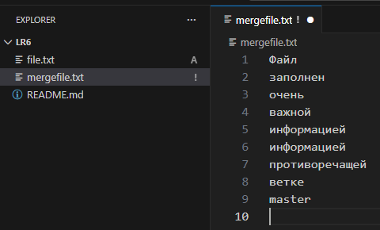
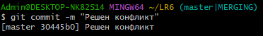
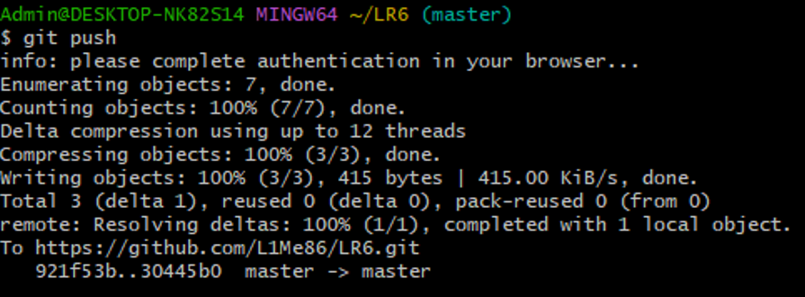

#### 10. Удаление побочной ветки.
```
git push origin --delete btanch1
```
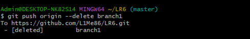

#### 11. Создание и фиксирование изменений.
```
echo "1-е изменение" >> file.txt
git status
git add .
git commit -m "1-е изменение файла file.txt"
```
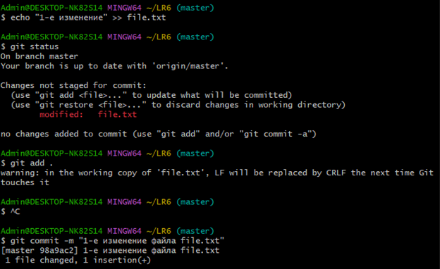
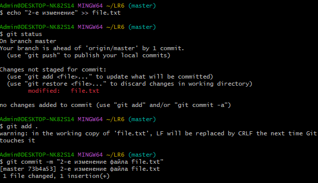

#### 12. Создание отката коммита.
```
git log --oneline
git reset --hard 98a9ac2
git push
```


#### 13. Создание ветки для отчёта.
```
git checkout -b report
```
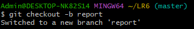

#### 14. Начало оформления отчёта.
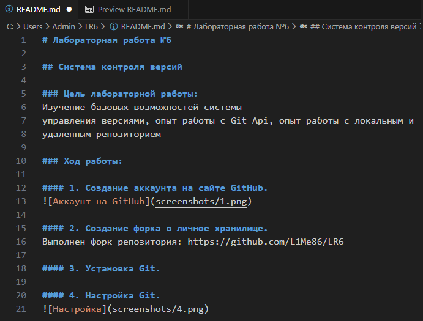

#### 15. Получение истории операций.
```
git log --pretty=format:"%h | %ad | %an | %s"
```
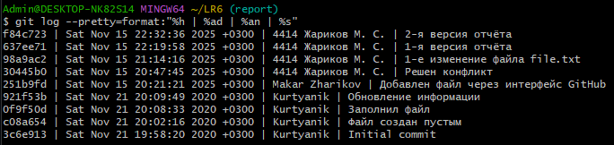

### Вывод:
В ходе выполнения работы были изучены базовые возможности системы
управления версиями, получен опыт работы с Git Api, опыт работы с локальным и удаленным репозиторием.